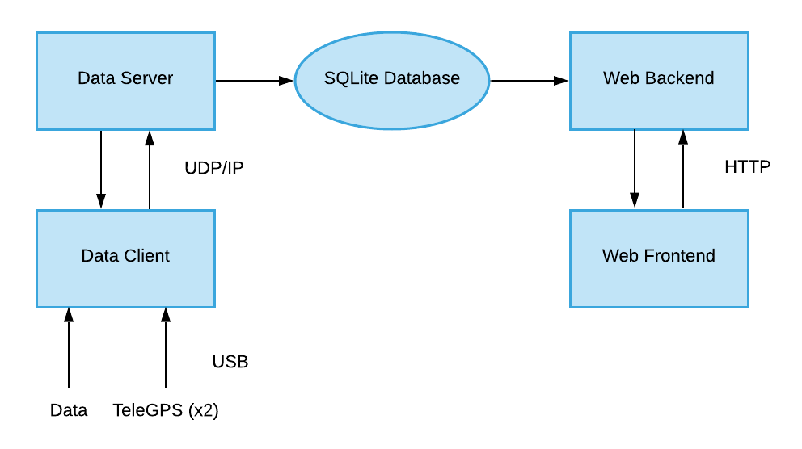

# Dashboard
MASA web dashboard continuing development

## Framework Used
<b> Built with </b>
* Python
* HTML, Javascript, CSS
* [Flask Microframework](https://flask.palletsprojects.com/en/1.1.x/) (pip install Flask)
* Flask-Cors (pip install Flask-Cors)
* [Leaflet Javascript Library](https://leafletjs.com/)
* matplotlib (pip install matplotlib)
* sqlalchemy (pip install sqlalchemy)
* [openCV](https://pypi.org/project/opencv-python/) (pip install opencv-python)
* crcmod (pip install crcmod)
* pyserial (pip install pyserial)

## Running the Dashboard
1. Open up the file dataserver.py and pass it a config file (using --config="\<filename\>"), this will be the data server code in the final
2. Open up the file app.py and pass it a config file  (using --config="\<filename\>"), this will be the web backend code in the final
3. Open up the file testclient.py and pass it a config file (using --config="\<filename\>"), this is simulating the input of the non-video M2RB data
4. Open up the file videoclient.py and pass it a config file (using --config="\<filename\>"), this is simulating the input of the video M2RB data

Note when testing you will want to use the config file "test.json". Also note that it is possible to run the Dashboard without simulating M2RB data.

## Dashboard To Do
* The documentation will need an almost complete overhaul
* Remove references to Eggfinder and replace with TeleGPS development (data types need an overhaul)
* The Dashboard needs a single runnable file to run the entire Dashboard so that testing, debugging and actually running the Dashboard is easier
* A well defined interface that sends data to the data client from a sub program that collects the data needs to be developed
* Figure out how the TeleGPS reports the transmitter voltage
* Modify map and GPS serial reader to work with current dashbaord rather than working independantly
  * Map needs to display GPS coordinates as a line with a start and end point rather than a series of dots at each recorded location
  * Map is not centering on the user location
  * Map needs the ability for the user to easily center on the user, booster, or dart
  * GPS serial reader needs config to be changed to json
* The TeleDongles require commands to begin sending data. The GPS serial reader must be set up to send these codes whenever data has not been received
* The Dashboard needs to be able to handle arbitrary data being sent from the rocket
  * Use predefined data types that can be configured (IE temperature, altitude, speed, etc)
  * Video needs to be simulated being sent through a COM port
  * Collaborate with Lucas since he is handling the setup and documentation on the rocket side
* The Dashboard needs to run without incoming data
  * Ability to select which set of data is being viewed and the timeframe the user is viewing
* The Dashboard needs to be tested on a web server
* The data client needs to save all data locally as a backup
  * The data client should be able to send the backup data to the server at a later date
* The data client should have the option to be disconnected and reconnected to the Dashboard without loss of data
  * Must be able to choose if this is a continuation of the last set of data or a new set of data
* Video needs the ability to be rewound, fast forwarded, and paused
* Should be able to download video once it is done being sent from the rocket
* Swap Button needs to be made more responsive, sometimes takes multiple clicks to register
* The Dashboard has a set size and does not display well on many devices
* Toggle for plot elements do not work at all
* Video requires the config file but does not use it for anything

